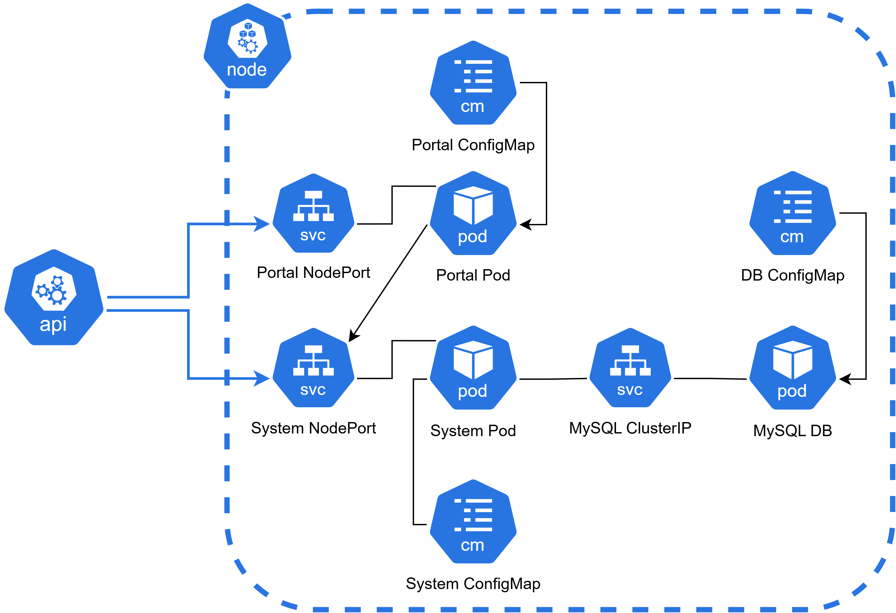

# A simple twitter-like K8S system
This project was created on my local computer and hence that, we will be using `minikube` on a WSL with docker drivers. 

Basically it's a news blog. When a user is logged in, it's possible to post a comment or upload a photo and the portal will show it to everyone once it's finished, no logging needed on portal-side. 

Below, the architecture design. 2 NodePort are the entrypoint to the app. User portal connects into user page and system page shows all posts available. User information and posts are all stored inside a MySQL Pod, containing just one DB container.

### CAVEAT

It's important to note that once I was using `minikube` within WSL and docker drivers, I had to expose any NodePort using `minikube service <NodePort service>`, with that, it successfully tunnels the desired port to one available by minikube!
